# **Laporan OS Pertemuan 1**

**Nama** : Akbar Bagus Wicaksana  
**NIM** : 254107020067  
**Kelas** : TI-1H  

---

## **1.10.1. Latihan Konseptual**

### **Latihan 1.1**
**Soal:** Jelaskan 5 fungsi utama sistem operasi dengan contoh konkret dari minimal 2 OS berbeda (Windows, macOS, atau Linux).

**Jawaban:**

1. **Manajemen Proses**
   Mengatur jalannya aplikasi dan alokasi penggunaan CPU.
   * **Windows:** Menggunakan *Task Manager* untuk mematikan paksa (*End Task*) aplikasi yang macet.
   * **Linux:** Menggunakan perintah `kill` di terminal untuk menghentikan proses spesifik yang membebani sistem.

2. **Manajemen Memori**
   Membagi alokasi RAM agar banyak aplikasi dapat berjalan bersamaan tanpa konflik.
   * **Windows:** Memanfaatkan *virtual memory* (`pagefile.sys`) saat RAM fisik penuh.
   * **macOS:** Menggunakan *Memory Compression* untuk memadatkan data di RAM sehingga performa tetap optimal.

3. **Manajemen File**
   Mengatur cara data disimpan, dinamai, dan diorganisir dalam sistem penyimpanan.
   * **Windows:** Menggunakan format file NTFS dan sistem huruf drive (C:, D:).
   * **Linux:** Menggunakan struktur pohon tunggal yang berpusat pada *root* (`/`) tanpa huruf drive.

4. **Manajemen Perangkat (I/O Device)**
   Menjembatani komunikasi antara *software* dan *hardware* (printer, mouse, dll).
   * **Windows:** Fitur *Plug and Play* otomatis mendeteksi perangkat keras baru dan menginstal driver-nya.
   * **macOS:** Menggunakan sistem *CoreAudio* yang sangat stabil dan minim latensi untuk kebutuhan perangkat audio tingkat lanjut.

5. **Antarmuka Pengguna (User Interface)**
   Media interaksi yang menerjemahkan instruksi pengguna ke dalam bahasa mesin.
   * **Windows/macOS:** Berbasis GUI (Grafis) dengan ikon dan jendela yang ramah pengguna awam.
   * **Linux (Server):** Berbasis CLI (Teks/Terminal) yang lebih ringan dan efisien untuk kebutuhan server.

---

### **Latihan 1.2**
**Soal:** Kapan sebaiknya menggunakan Windows vs Linux vs macOS? Analisis berdasarkan *use case*: gaming, development, server, creative work, dan enterprise.

**Jawaban:**

| Use Case | OS Pilihan Utama | OS Alternatif / Spesifik | Alasan Utama & Analisis |
| :--- | :--- | :--- | :--- |
| **1. Gaming** | **Windows** | Linux (Mulai berkembang via Steam Proton)    *macOS sangat lemah di sektor ini.* | Windows adalah standar industri PC gaming dengan dukungan driver GPU (NVIDIA/AMD) dan DirectX paling optimal. Game *native* di Linux/macOS masih sangat terbatas. |
| **2. Development** | **Sesuai Kebutuhan** | **Linux:** Backend/Cloud/AI.   **macOS:** iOS App & Web Dev.   **Windows:** Game Dev (.NET) & Enterprise. | Pemilihan OS bergantung pada target platform. Linux ideal untuk server/Docker, macOS wajib untuk *compile* aplikasi iOS (Xcode), dan Windows terbaik untuk *engine* game (Unity/Unreal) serta C#. |
| **3. Server** | **Linux** | **Windows:** Khusus ekosistem Microsoft (Active Directory, SQL Server). | Linux mendominasi infrastruktur *cloud* karena gratis (Open Source), sangat stabil, aman, dan bisa dijalankan tanpa grafis (*headless*) sehingga hemat *resource*. |
| **4. Creative Work** | **macOS** (2D/Audio/Video) | **Windows:** Unggul untuk 3D Modeling (Blender/Maya) & Arsitektur. | macOS adalah standar studio kreatif berkat akurasi warna bawaan, *latency* audio rendah, dan aplikasi eksklusif (Final Cut/Logic Pro). Windows dipilih jika butuh kekuatan GPU ganda untuk *render* 3D berat. |
| **5. Enterprise** | **Windows** | **macOS:** Populer di tingkat eksekutif/startup.   **Linux:** Hanya untuk tim IT. | Windows tak tertandingi dalam manajemen skala besar berkat *Active Directory* dan *Group Policy*. Dukungan aplikasi *legacy* perkantoran dan pilihan hardware-nya juga paling luas. |

---

## **1.10.2. Latihan Praktikal**

### **Latihan 1.3**
**Soal:** Install Ubuntu Server 22.04 LTS di VirtualBox dengan langkah berikut:
1. Download Ubuntu Server ISO dari website resmi
2. Create VM baru di VirtualBox (RAM: 2GB, Disk: 25GB)
3. Install dengan automatic partitioning (guided)
4. Buat user account dengan password yang kuat
5. Reboot dan login ke sistem
6. Dokumentasikan proses instalasi dengan screenshot key steps

**Jawaban:**

1. **Download Ubuntu Server**
   

2. **Create VM baru di VirtualBox**
   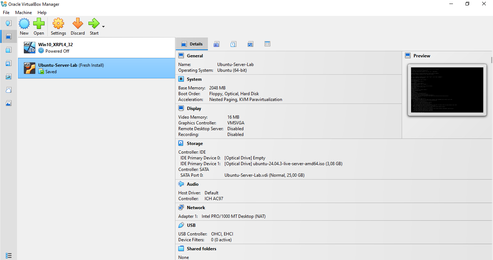

3. **Setelah selesai install dan membuat user account, lanjut dengan memilih untuk reboot lalu login ke sistem**
   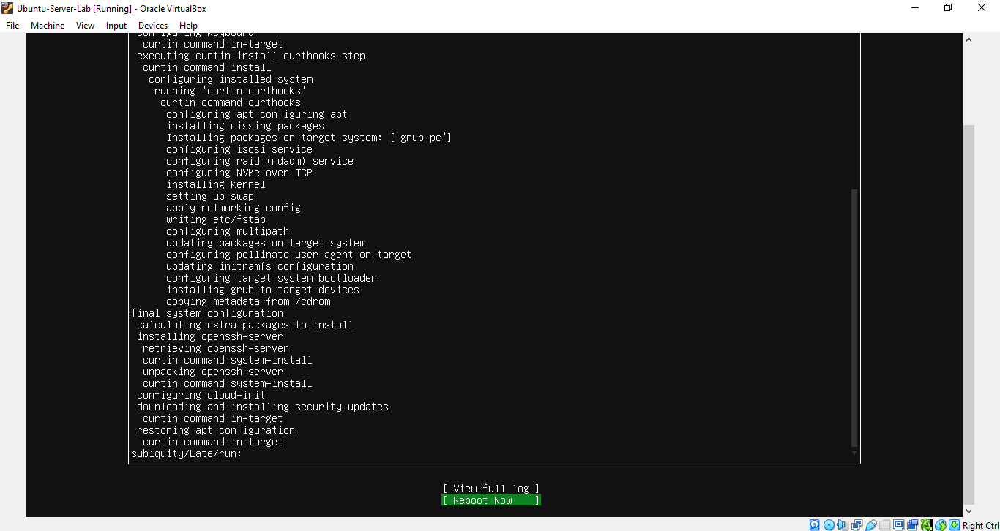

4. **Tampilan setelah berhasil login**
   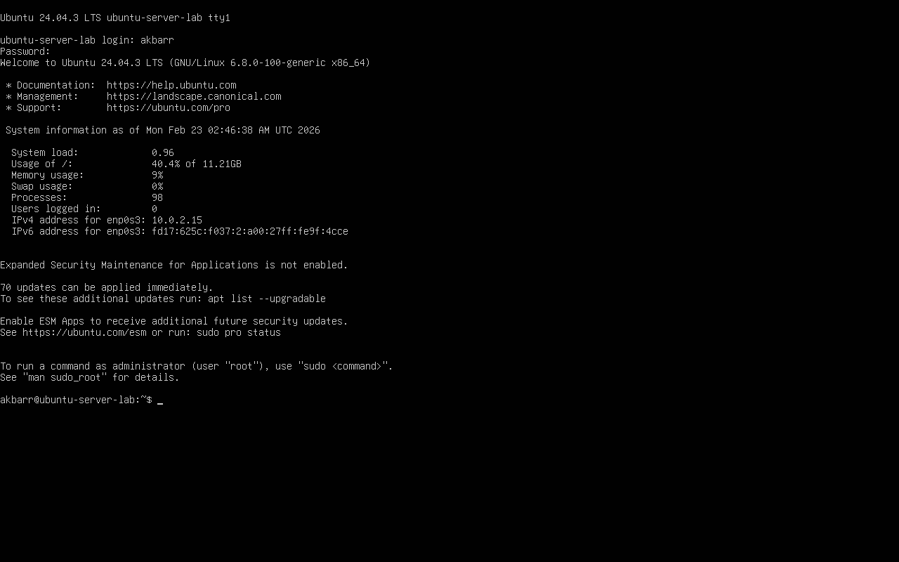

### **Latihan 1.4**
**Soal:** Setelah instalasi Ubuntu Server, lakukan tasks berikut:
1. Update package list: sudo apt update
2. Upgrade packages: sudo apt upgrade
3. Install neofetch: sudo apt install neofetch
4. Jalankan neofetch dan screenshot hasilnya
5. Check disk usage dengan df -h
6. Check memory dengan free -h
7. Dokumentasikan output dari setiap command

**Jawaban:**

1. **Update package list: sudo apt update**
   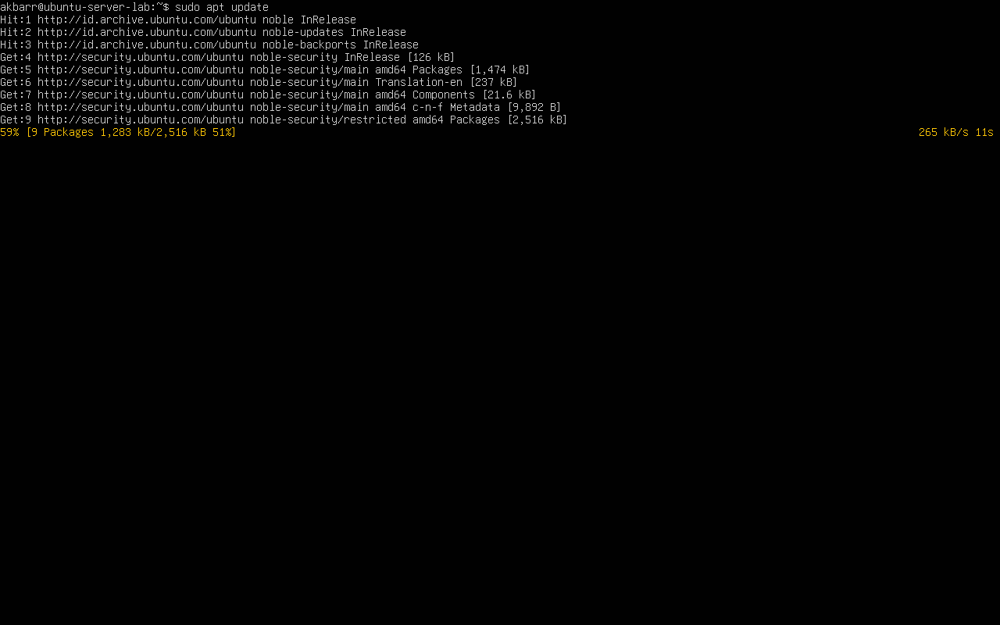

2. **Upgrade packages: sudo apt upgrade**
   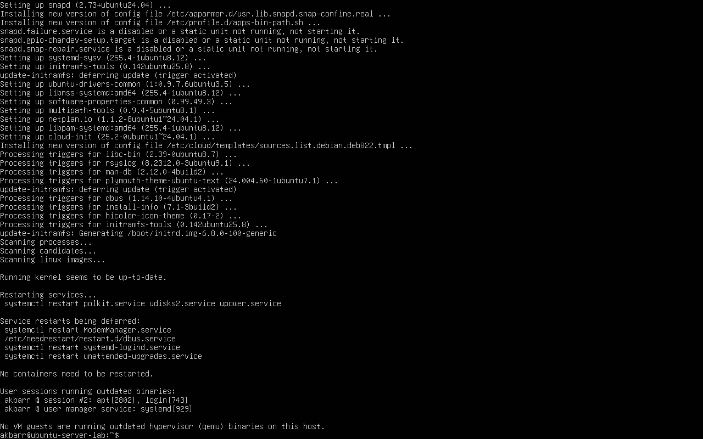

3. **Install neofetch: sudo apt install neofetch dan Jalankan neofetch**
   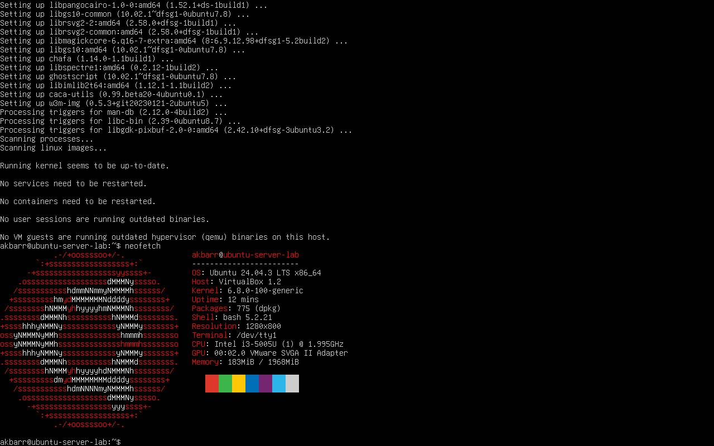

4. **Check disk usage dengan df -h**
   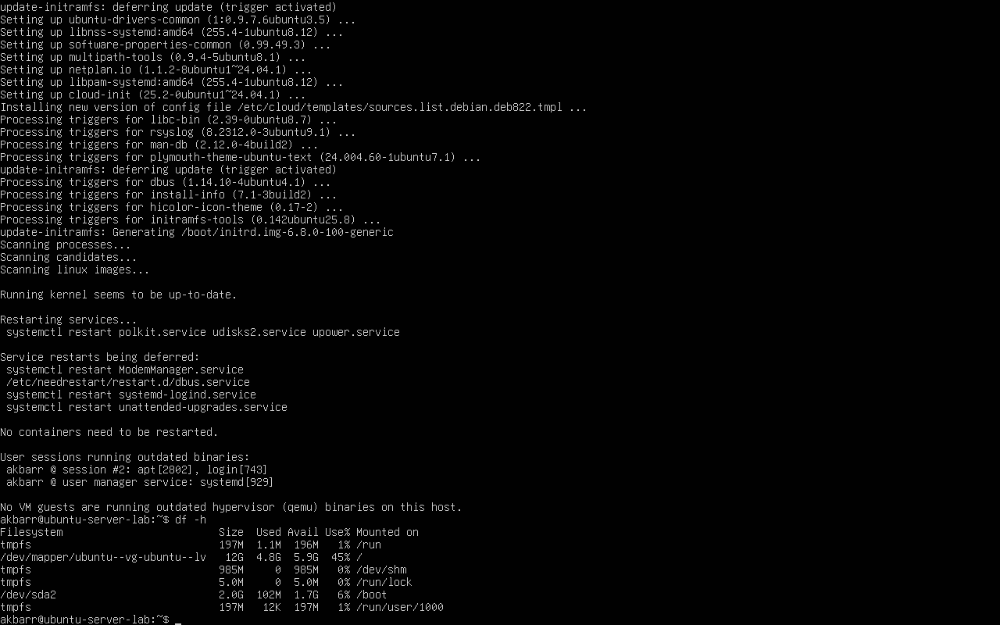

5. **Check memory dengan free -h**
   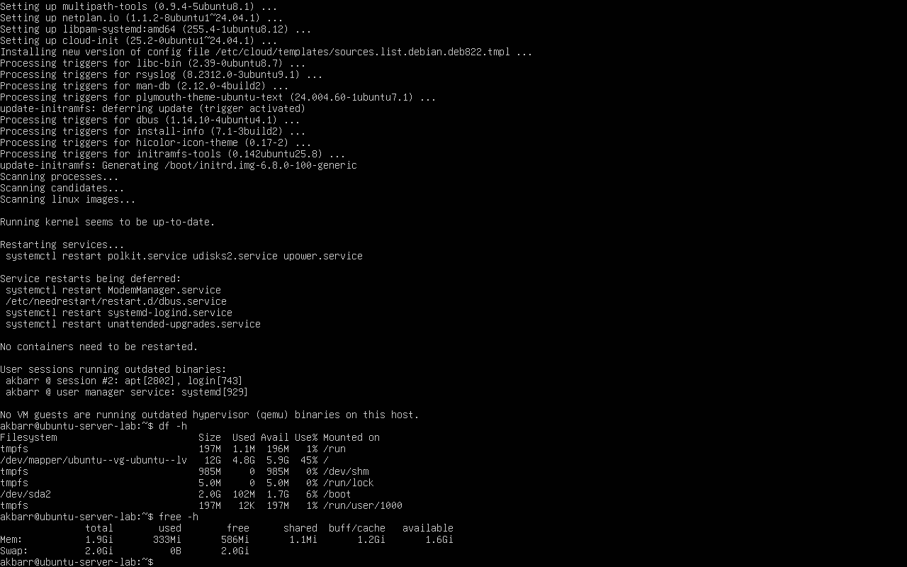

### **Latihan 1.5**
**Soal:** Eksplorasi sistem yang baru diinstall:
1. Tampilkan informasi OS: cat /etc/os-release
2. Tampilkan versi kernel: uname -r
3. List partisi: lsblk
4. Check network connectivity: ping -c 4 google.com
5. Install dan jalankan htop untuk melihat resource usage
6. Buat laporan singkat tentang konfigurasi sistem Anda

**Jawaban:**

1. **Tampilkan informasi OS: cat /etc/os-release**
   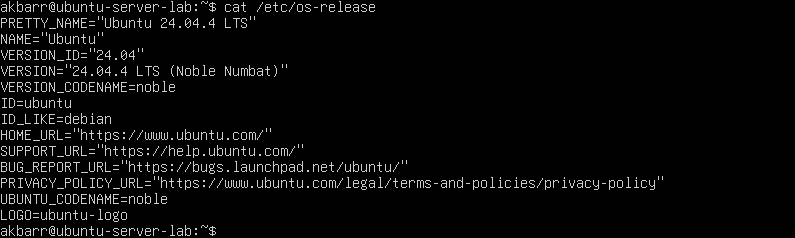

2. **Tampilkan versi kernel: uname -r**
   

3. **List partisi: lsblk**
   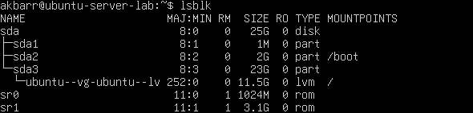

4. **Check network connectivity: ping -c 4 google.com**
   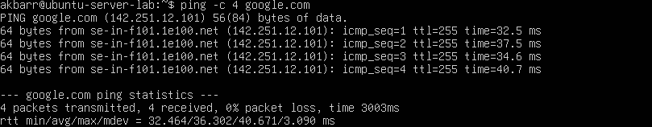

5. **Install dan jalankan htop untuk melihat resource usage**
   

6. **Buat laporan singkat tentang konfigurasi sistem Anda**
   
