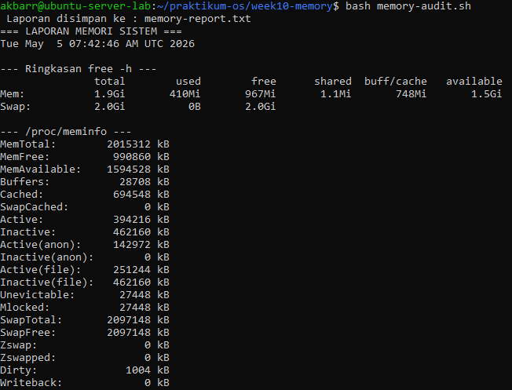
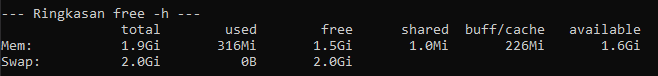
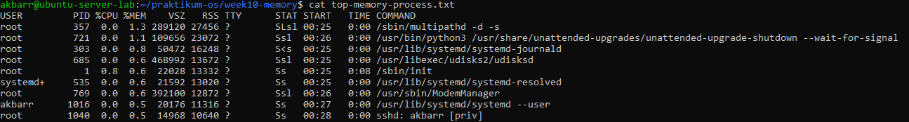
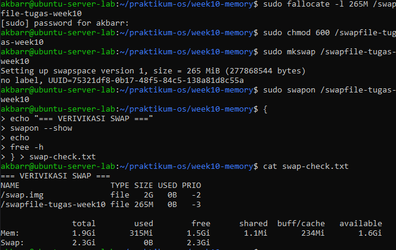
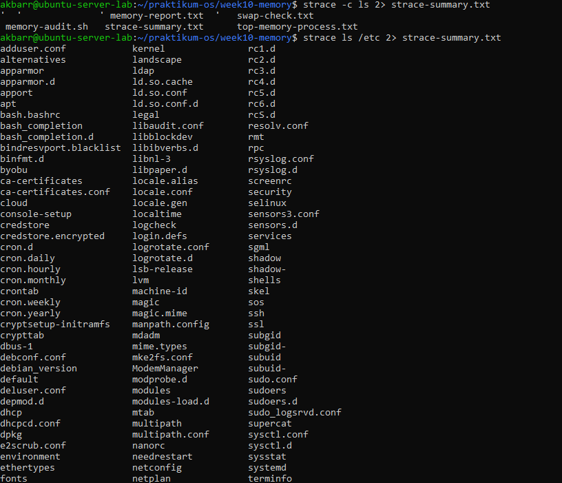
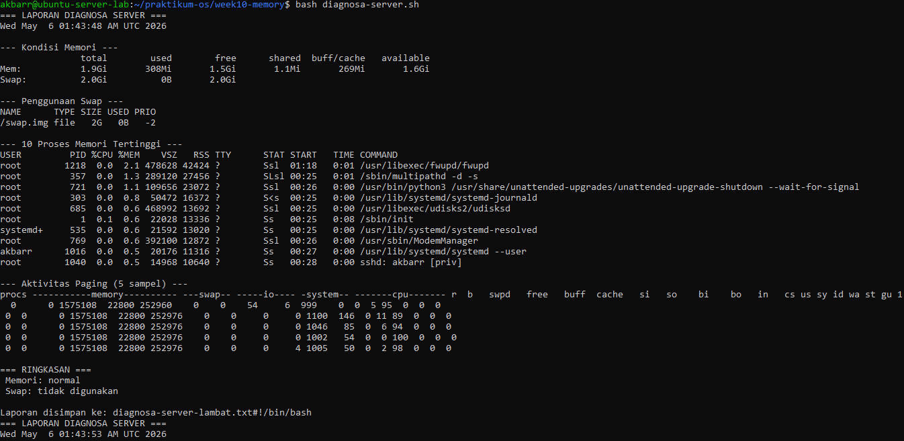
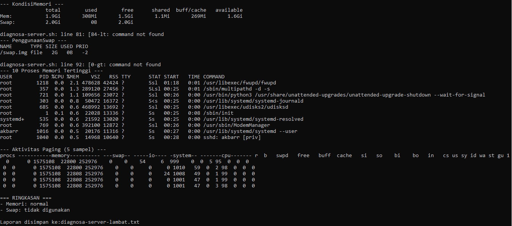

# **Laporan OS Pertemuan 10**

**Nama** : Akbar Bagus Wicaksana  
**NIM** : 254107020067  
**Kelas** : TI-1H  

---

## **Tugas 10.1 Audit Penggunaan Memori Sistem**  
**Intruksi:**  
Buat script memory-audit.sh yang menghasilkan laporan kondisi memori sistem secara otomatis.  
  
**Analisis**  
1. Hitung persentase memori tersedia (available / total × 100%). Apakah sistem dalam kondisi normal?  
**Jawaban:**  
  
Persentase memori yang tersedia di sistem saya adalah sekitar 84.21%. Karena nilai ini jauh di atas ambang batas kritis (di bawah 10% atau 20%), maka kondisi memori sistem saya tergolong sangat aman dan normal. Sistem masih memiliki ruang yang sangat lega untuk menjalankan aplikasi atau proses baru.  
2. Mengapa buff/cache tidak dihitung sebagai memori yang terpakai dari sudut pandang ketersediaan untuk aplikasi?  
**Jawaban:** Karena memori yang digunakan sebagai buff/cache hanyalah titipan sementara oleh kernel untuk mempercepat performa I/O disk. Jika sewaktu-waktu ada aplikasi yang membutuhkan RAM nyata, kernel akan secara otomatis dan instan membuang/membebaskan cache tersebut dan memberikannya ke aplikasi.  
3. Dari /proc/meminfo, apakah SwapTotal lebih besar dari 0? Berapa nilai SwapFree?  
**Jawaban:** Karena nilai SwapTotal dan SwapFree sama persis (2097148 kB), ini berarti sistem saya memiliki ruang swap yang aktif dan dialokasikan, namun saat ini belum terpakai sama sekali oleh sistem (penggunaan swap masih 0 kB). Hal ini wajar karena RAM utama saya masih sangat lega.  

## **Tugas 10.2 Identifikasi Proses dengan Memori Tertinggi**  
**Intruksi:**  
Simpan daftar 10 proses pengguna memori terbesar ke file.  
  
**Analisis**  
1. Proses apa di urutan pertama? Catat nilai %MEM dan RSS  
**Jawaban:** Proses di urutan pertama (paling atas setelah header) adalah daemon sistem /sbin multipathd -d -s. Nilai persentase %MEM adalah 1.3 dan untuk nilai RSS adalah 27456.  
2. Konversikan RSS ke MB (bagi 1024). Apakah wajar?  
**Jawaban:**  Jika dikonversi ke MB maka hasilnya 26.8125 MB. Penggunaan RAM sebesar ini sangat wajar untuk sebuah layanan tingkat sistem (daemon) seperti multipathd yang bertugas mengelola jalur perangkat penyimpanan di latar belakang pada server Linux.  
3. Jumlahkan %MEM dari 5 proses teratas. Berapa persen RAM yang mereka gunakan bersama?  
**Jawaban:** Kelima proses pengguna memori terbesar tersebut secara kumulatif hanya menggunakan 4.4% dari total RAM sistem saya secara bersamaan. Ini menunjukkan beban server saya saat ini masih sangat ringan.  

## **Tugas 10.3 Membuat dan Memverifikasi Swap File**  
**Intruksi:**  
Buat swap file khusus tugas sebesar 256 MB dan verifikasi.  
  
**Analisis**  
1. Identifikasi kolom NAME, TYPE, SIZE, dan USED pada output swapon –show.  
**Jawaban:**  
- Name: /swapfile-tugas-week10  
- TYPE: file  
- SIZE: 265M  
- USED: 0B  
2. pakah nilai total pada baris Swap di free -h bertambah 256 MB?  
**Jawaban:** Ya, bertambah. Pada output free -h, nilai total pada baris Swap sekarang menunjukkan 2.3Gi  
3. Mengapa permission 600 penting? Apa risiko jika diatur ke 644?  
**Jawaban:** Izin 600 menjamin bahwa hanya pengguna root (administrator) yang memiliki hak untuk membaca dan menulis ke dalam file swap tersebut. Risikonya Jika diatur ke 644, pengguna biasa (others) akan memiliki hak akses baca (read) terhadap file tersebut. Ini sangat berbahaya karena kernel Linux menggunakan file swap untuk menyimpan "buangan" sementara dari RAM. Pengguna lain yang iseng bisa saja membaca isi file tersebut dan menemukan informasi yang sangat sensitif, seperti password, isi pesan, atau data kredensial dari aplikasi yang sedang Anda jalankan.  

## **Tugas 10.4 Analisis System Call dengan strace**  
**Intruksi:**  
Analisis system call yang dipanggil perintah ls.  
  
**Analisis**  
1. Sebutkan minimal 5 system call dari strace-summary.txt beserta fungsi singkatnya.  
**Jawaban:**  
- openat: Membuka file atau direktori.  
- read: Membaca data dari sebuah file.  
- close: Menutup jalur file yang sudah selesai diakses.  
- write: Menampilkan (print) keluaran data ke terminal.  
- mmap: Memetakan file atau blok daya ke dalam memori.  
2. System call mana yang paling sering dipanggil? Mengapa?  
**Jawaban:** Pada perintah ls, system call seperti openat, close, dan read sangat sering dipanggil karena perintah ini perlu membuka, membaca metadata, dan menutup kembali setiap file yang ada di dalam direktori target satu per satu.  
3. Apakah ada errors lebih dari 0? Apakah program tetap berjalan normal meskipun ada kegagalan tersebut?  
**Jawaban:** Seringkali ada error, khususnya ENOENT (No such file or directory) ketika program mencari konfigurasi atau library tambahan. Program tetap berjalan normal karena program didesain untuk menangani kegagalan tersebut (misalnya, mencoba mencari library di folder (path) alternatif lainnya).  

## **Tugas 10.5 Studi Kasus Diagnosa Server Lambat**  
**Skenario:**  
Server terasa lambat. Buat script diagnosa yang menggabungkan semua pemeriksaan dari bab ini menggunakan fungsi Bash. Analisis system call yang dipanggil perintah ls.  
  
  
**Analisis**  
1. Jelaskan peran masing-masing fungsi: cek_memori, cek_swap, cek_proses, cek_paging, dan ringkasan. Mengapa diagnosa dipecah menjadi fungsi terpisah?  
**Jawaban:**  
- cek_memori: Menghitung ketersediaan RAM.  
- cek_swap: Memeriksa apakah swap sedang digunakan.  
- cek_proses: Menampilkan 10 aplikasi pemakan memori terbesar.  
- cek_paging: Memantau vmstat untuk melihat swap in/out.  
- ringkasan: Menyimpulkan status keseluruhan.  
Pemecahan ini membuat script lebih terstruktur, modular, mudah dibaca, dan bagian-bagian fungsinya dapat dipanggil ulang tanpa menulis ulang command yang sama.
2. Berdasarkan bagian RINGKASAN, apakah kondisi sistem normal atau kritis? Jelaskan berdasarkan nilai threshold yang digunakan script.  
**Jawaban:** Sistem disebut "KRITIS" apabila persentase ketersediaan memori (AVAIL_PCT) berada di bawah angka 20%. Jika di atas atau sama dengan 20%, maka WARN_MEM akan tetap false dan sistem dianggap normal.  
3. Mengapa script menggunakan tee "$LAPORAN" bukan redirection biasa > "$LAPORAN"? Apa keuntungannya?  
**Jawaban:** Redirection biasa (>) hanya akan membuang hasil proses ke dalam file secara senyap. Penggunaan perintah tee memberikan keuntungan ganda: output ditampilkan langsung di layar terminal secara interaktif, sekaligus di saat yang sama disalin (disimpan) ke dalam file laporan.  
4. Dari output cek_paging, apakah ada aktivitas si atau so? Jika ada apa implikasinya terhadap performa server?  
**Jawaban:** Kolom si (swap in) dan so (swap out) pada perintah vmstat menandakan lalu lintas data dari RAM ke disk. Jika nilai kedua indikator ini terus-menerus bernilai lebih dari 0, ini mengimplikasikan bahwa server mengalami tekanan memori (memory pressure) yang serius. Performa server akan menurun drastis karena sistem terlalu sibuk memindahkan data ke disk (yang sangat lambat) dibandingkan mengeksekusi program di RAM (yang sangat cepat).