# **Laporan OS Pertemuan 2**

**Nama** : Akbar Bagus Wicaksana  
**NIM** : 254107020067  
**Kelas** : TI-1H  

---

## **Praktikum: Manajemen Perangkat Keras & Perintah Dasar**

### **Praktikum 2.1 Identifikasi CPU dan Memori**
**Tujuan:** Memahami spesifikasi CPU dan kondisi memori pada server/VM.

**Langkah-langkah:**

1. **Tampilkan informasi CPU: lscpu** 
   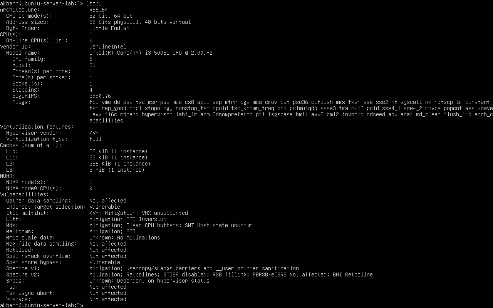

2. **Tampilkan ringkasan memori: free -h** 
   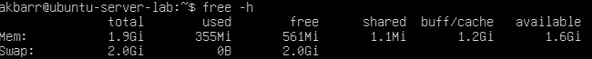

### **Praktikum 2.2 Identifikasi Perangkat PCI/USB dan Driver**
**Tujuan:** Mengenali perangkat PCI/USB dan melihat driver/modul yang dipakai.

**Langkah-langkah:**

1. **Lihat daftar perangkat PCI: lspci** 
   

2. **Lihat perangkat PCI beserta driver kernel yang digunakan: lspci -nnk** 
   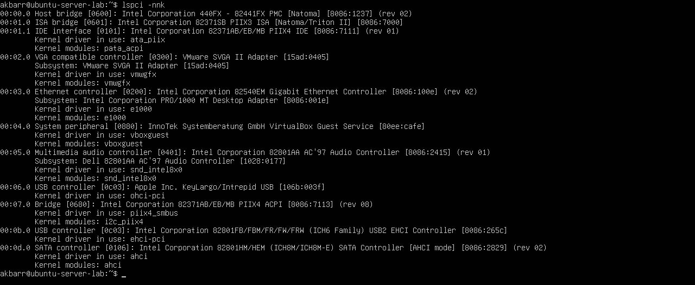

3. **Fokus pada NIC (Ethernet) untuk mencari modul driver: lspci -nnk | grep -A3 -i ethernet** 
   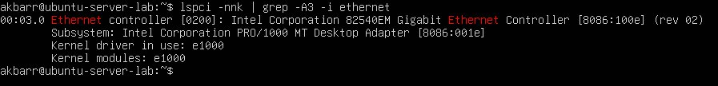

4. **Lihat perangkat USB: lsusb** 

   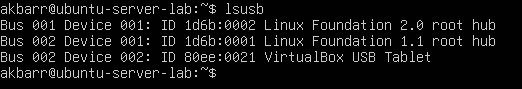

5. **Lihat topologi USB (tree): lsusb -t** 
   

### **Praktikum 2.3 Identifikasi Storage dan Filesystem**
**Tujuan:** Memahami disk/partisi dan filesystem yang terpasang.

**Jawaban:**

1. **Lihat daftar disk/partisi: lsblk -f** 
   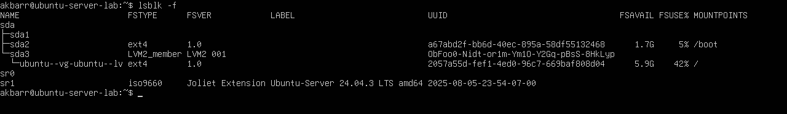

2. [cite_start]**Tampilkan UUID dan tipe filesystem: sudo blkid** 
   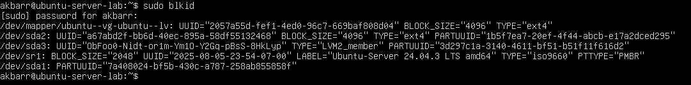

3. **Lihat mount point untuk root filesystem: findmnt /** 
   
   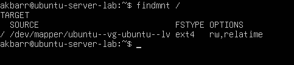

### **Praktikum 2.4 Melihat Modul Aktif dan Informasinya**
**Tujuan:** Mengenal modul aktif dan keterkaitannya dengan perangkat.

**Langkah-langkah:**

1. **Cek versi kernel: uname -r** 

   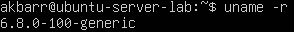

2. **Tampilkan daftar modul aktif: lsmod | head** 

   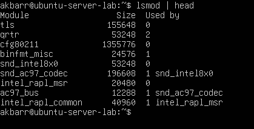

3. **Pilih salah satu modul (contoh aman: loop) dan lihat detailnya: modinfo loop** 
   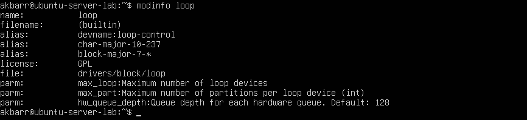

4. **Muat modul (jika belum aktif), lalu verifikasi: sudo modprobe loop dilanjut lsmod | grep -i loop** 
   

### **Praktikum 2.5 Konfigurasi Auto-load dan Blacklist**
**Tujuan:** Memahami cara membuat modul otomatis dimuat atau diblokir.

**Langkah-langkah:**

1. **Buat file auto-load: echo "loop" | sudo tee /etc/modules-load.d/loop.conf** 
   

2. **Simulasikan verifikasi dengan memastikan modul sudah aktif: lsmod | grep -i loop** 
   

### **Praktikum 2.6 Mengenali Block vs Character Device**
**Tujuan:** Membedakan perangkat disk vs terminal.

**Langkah-langkah:**

1. **Lihat detail salah satu disk (Block Device): ls -l /dev/sda** 

   

2. **Lihat detail device terminal (Character Device): ls -l /dev/tty** 

   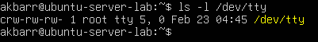

3. **Lihat disk dan partisi untuk mengaitkan dengan /dev: lsblk** 
   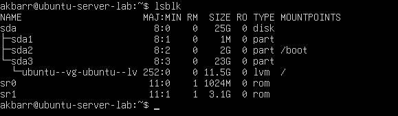

### **Praktikum 2.7 Melihat Informasi udev**
**Tujuan:** Melihat metadata yang dipakai udev untuk membuat device node.

**Langkah-langkah:**

1. **Cek atribut udev untuk disk: udevadm info --query=all --name=/dev/sda | head -n 30** 
   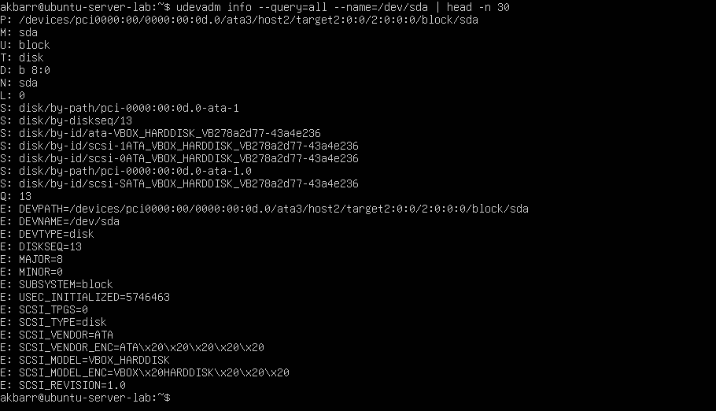

### **Praktikum 2.8 Membuat Workspace Praktikum**
**Tujuan:** Membuat area kerja aman untuk semua latihan bab ini.

**Langkah-langkah:**

1. **Buat direktori praktikum dan masuk ke dalamnya: mkdir -p ~/praktikum-os/week02` lalu `cd ~/praktikum-os/week02** 
   

2. **Buat beberapa file contoh: touch notes.txt data.log config.txt lalu ls -lah** 
   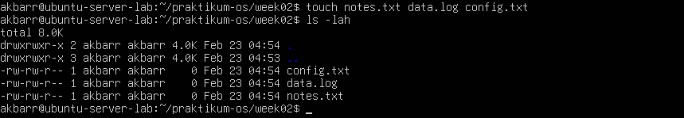

3. **Isi file log contoh: gunakan perintah `echo` ke dalam `data.log` lalu lihat isinya dengan cat data.log** 
   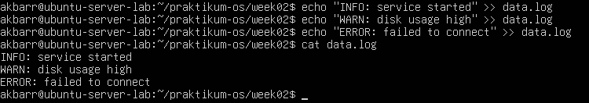

4. **Baca file dengan less: less data.log** 

   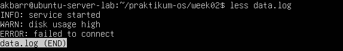

### **Praktikum 2.9 Pencarian Pola dengan grep**
**Tujuan:** Mencari baris yang cocok dengan pola (pattern) di file.

**Langkah-langkah:**

1. **Cari baris yang mengandung ERROR pada data.log: grep "ERROR" data.log** 
   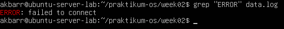

2. **Cari tanpa memperhatikan huruf besar/kecil: grep -i "error" data.log** 
   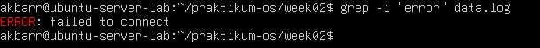

3. **Tampilkan nomor baris: grep -n "WARN" data.log** 
   

4. **Tampilkan baris yang tidak cocok (invert match): grep -v "INFO" data.log** 
   

### **Praktikum 2.10 Substitusi dengan sed**
**Tujuan:** Melakukan transformasi teks, terutama substitusi (cari-ganti).

**Langkah-langkah:**

1. **Siapkan file konfigurasi latihan: config.txt** 
   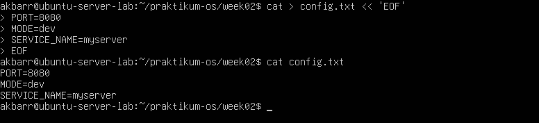

2. **Ganti dev menjadi prod (tanpa mengubah file asli): sed 's/MODE dev/MODE=prod/' config.txt** 
   

3. **Terapkan perubahan langsung ke file (-i): sed -i 's/MODE dev/MODE=prod/' config.txt lalu cat config.txt** 
   

4. **Ganti semua kemunculan kata (global replacement): sed -i 's/myserver/node/g' config.txt lalu cat config.txt** 
   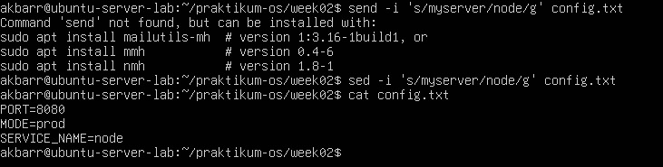

### **Praktikum 2.11 Ekstraksi Kolom dengan awk**
**Tujuan:** Memproses teks berbasis kolom/field.

**Langkah-langkah:**

1. **Lihat output: df -h** 

   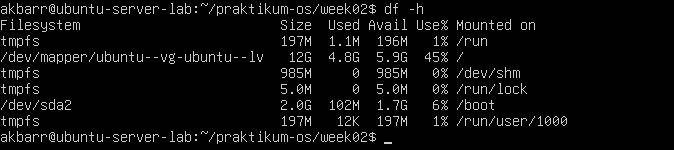

2. **Ambil kolom filesystem dan persentase pemakaian: df -h | awk 'NR==1 {print $1, $5, $6} NR>1 {print $1, $5, $6}'** 
   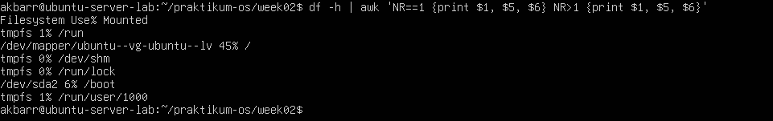

3. **Filter hanya yang pemakaian disk di atas 80%: df -h | awk 'NR==1 || ($5+0) [cite_start]> 80 {print $1, $5, $6}'** 
   

### **Praktikum 2.12 Melihat Proses dengan ps**
**Tujuan:** Melihat snapshot proses dan pemakaian CPU/MEM.

**Langkah-langkah:**

1. **Tampilkan semua proses (format BSD): ps aux | head** 
   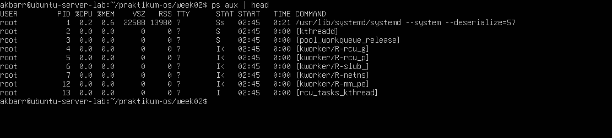

2. **Cari proses tertentu (misal sshd): ps aux | grep -i sshd** 
   

### **Praktikum 2.13 Monitoring Real-time dengan top**
**Tujuan:** Memantau pemakaian resource secara real-time.

**Langkah-langkah:**

1. **Jalankan top dan amati pemakaian CPU/RAM: top** 
   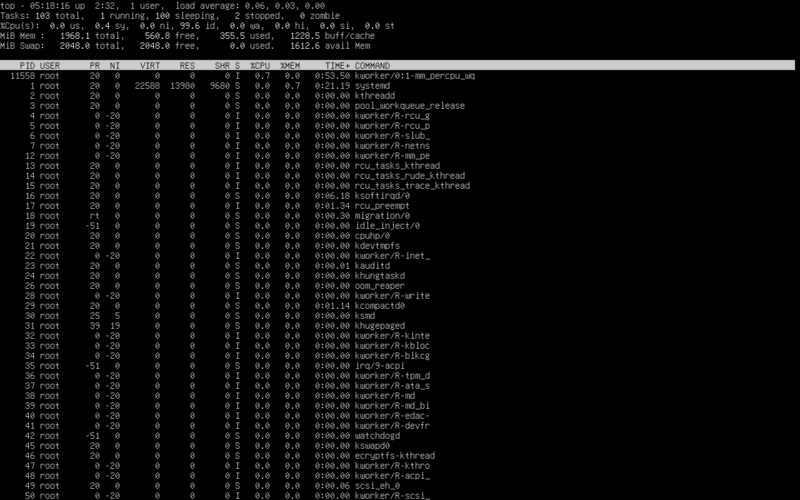

### **Praktikum 2.14 Menghentikan Proses dengan kill**
**Tujuan:** Mengirim sinyal untuk menghentikan proses berdasarkan PID.

**Langkah-langkah:**

1. **Jalankan proses dummy di background: sleep 300 &** 
   

2. **Cari PID proses sleep: ps aux | grep -E "sleep 300" | grep -v grep** 
   

3. **Hentikan dengan SIGTERM: kill <PID_ANDA>** 
   

4. **Verifikasi proses berhenti: ps aux | grep -E "sleep 300" | grep -v grep** 
   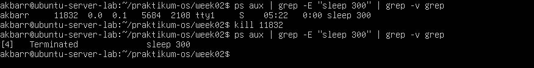

### **Praktikum 2.15 Cek Disk, Load, dan Service**
**Tujuan:** Melakukan "Health Check" pada server.

**Langkah-langkah:**

1. **Cek penggunaan disk: df -h** 

   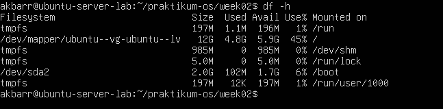

2. **Cari direktori yang besar: sudo du -sh /var/* 2>/dev/null | sort -h | tail -n 10** 
   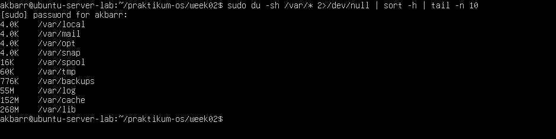

3. **Cek load dan uptime: uptime** 

   

4. **Cek service yang gagal: systemctl --failed** 

   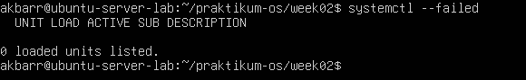

5. **Ambil log error terbaru: journalctl -xe | tail -n 50** 
   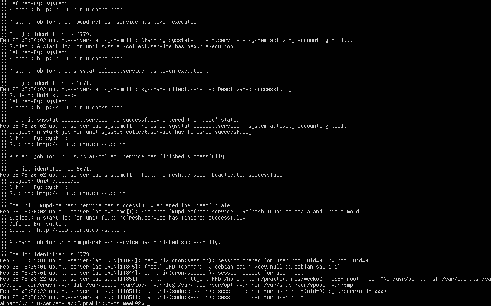

### **Praktikum 2.16 Monitoring Port dan Koneksi**
**Tujuan:** Melihat interface, routing, dan port yang sedang listen.

**Langkah-langkah:**

1. **Lihat interface dan IP: ip a** 
   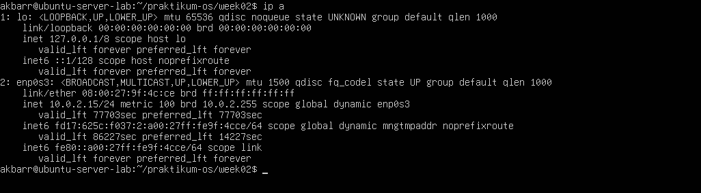

2. **Lihat routing table: ip r** 

   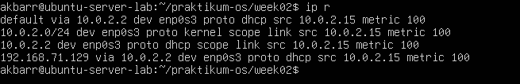

3. **Lihat port yang sedang listening: sudo ss -tulpn** 
   

---

## **Latihan Praktikal**

### **Latihan 2.A**
**Soal:** Jalankan lspci -nnk. Pilih 1 perangkat PCI dan tuliskan: nama perangkat, ID vendor:device, dan kernel driver in use.

**Jawaban:**

1. **Jalankan lspci -nnk dan pilih perangkat:**
   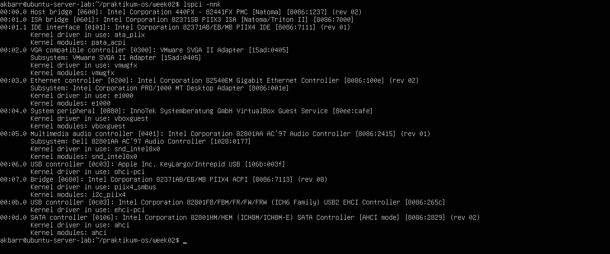

2. **Hasil Analisis (Sesuai Screenshot):**
   * **Nama Perangkat:** Ethernet controller: Intel Corporation 82540EM Gigabit Ethernet Controller
   * **ID Vendor:Device:** [8086:100e]
   * **Kernel driver in use:** e1000

### **Latihan 2.B**
**Soal:** Tentukan device root filesystem dengan findmnt /. Lalu cocokkan dengan lsblk -f dan tuliskan tipe filesystem serta UUID-nya.

**Jawaban:**

1. **Tentukan device root: findmnt /**

   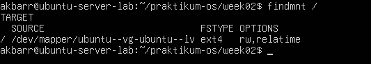

2. **Cocokkan dengan partisi: lsblk -f**
   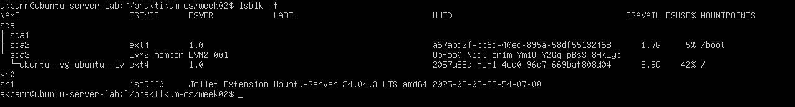

3. **Hasil Analisis:**
   * **Device Root (`/`):** ubuntu--vg-ubuntu--lv
   * **Tipe Filesystem:** ext4 
   * **UUID:** 2057a55d-fef1-4ed0-96c7-669baf808d04

### **Latihan 2.C**
**Soal:** Buat file server.log berisi minimal 10 baris dengan variasi kata: INFO, WARN, ERROR. Gunakan grep untuk menampilkan hanya baris ERROR.

**Jawaban:**

1. **Buat file server.log dengan perintah cat > server.log lalu isi 10 baris:**
   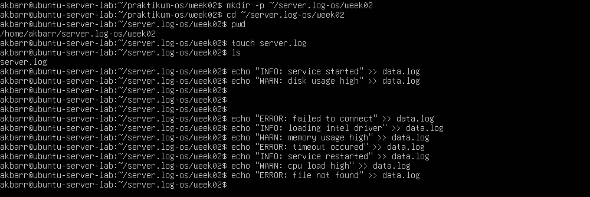

2. **Gunakan grep untuk mencari kata ERROR: grep "ERROR" server.log**
   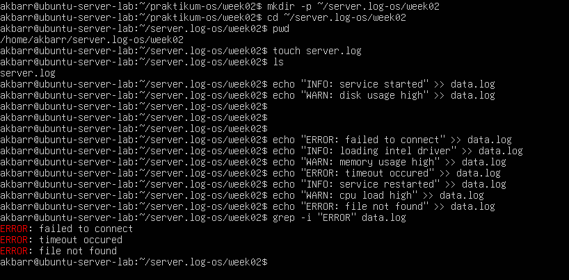

### **Latihan 2.D**
**Soal:** Gunakan sed untuk mengganti semua kata server menjadi node pada file latihan. Tunjukkan sebelum dan sesudah.

**Jawaban:**

1. **Tampilkan teks SEBELUM diubah: cat server.log**

   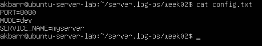

2. **Gunakan perintah sed -i 's/server/node/g' server.log lalu tampilkan hasilnya SESUDAH diubah:**
   

### **Latihan 2.E**
**Soal:** Gunakan `df -h` lalu `awk` untuk menampilkan filesystem yang penggunaan disk di atas 70%.

**Jawaban:**

1. **Jalankan perintah: df -h | awk 'NR==1 || ($5+0) > 70 {print $1, $5, $6}'**
   

### **Latihan 2.F**
**Soal:** Jalankan sleep 600 &. Temukan PID-nya dengan ps. Hentikan dengan SIGTERM. Jelaskan beda SIGTERM vs SIGKILL.

**Jawaban:**

1. **Jalankan proses sleep 600 & lalu temukan PID-nya dengan `ps aux | grep sleep:**
   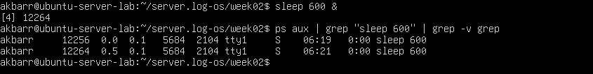

2. **Hentikan dengan perintah kill <PID>:**

   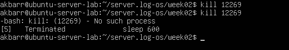

3. **Perbedaan SIGTERM vs SIGKILL:**
   * **SIGTERM (15):** Meminta proses berhenti secara baik-baik, aplikasi bisa menyimpan data dulu sebelum mati.
   * **SIGKILL (9):** Memaksa proses berhenti seketika tanpa ampun.

### **Latihan 2.G**
**Soal:** Gunakan systemctl --failed. Jika tidak ada yang gagal, pilih satu service aktif (misal ssh) dan tampilkan status serta 30 baris log terakhirnya.

**Jawaban:**

1. **Gunakan perintah: systemctl --failed**

   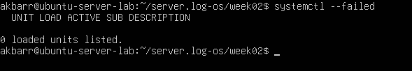

2. **Tampilkan status service aktif (contoh: ssh): systemctl status ssh**
   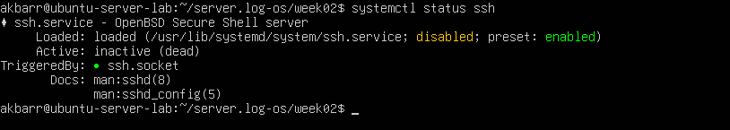

3. **Tampilkan 30 baris log terakhirnya: journalctl -u ssh -n 30**
   