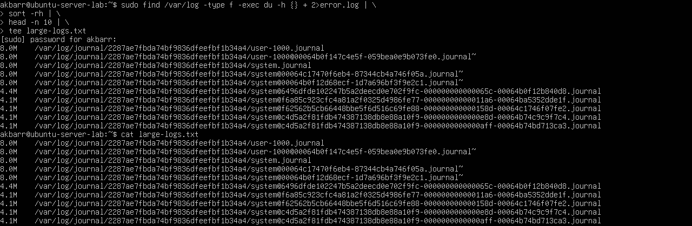
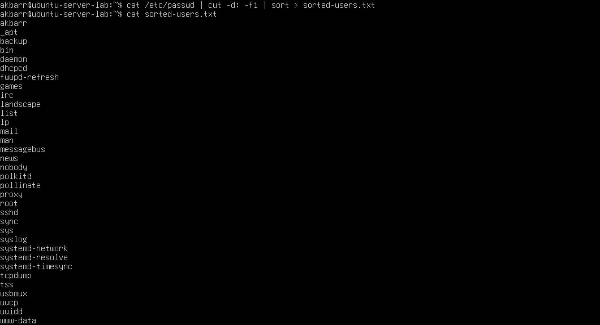

# **Laporan OS Pertemuan 3**

**Nama** : Akbar Bagus Wicaksana  
**NIM** : 254107020067  
**Kelas** : TI-1H  

---

### **Latihan 3.1 Identifikasi CPU dan Memori**
**Buatlah Script yang:**  
1.Menampilkan daftar 10 file terbesar di direktori /var/log/
2.Menyimpan hasilnya ke file large-logs.txt  
3.Menampilkan output juga di terminal menggunakan tee  
4.Menangani error dengan redirect ke error.logMemahami spesifikasi CPU dan kondisi memori pada server/VM.

**Hasil:**

1. **Tampilkan informasi CPU: lscpu** 
   

2. **Tampilkan ringkasan memori: free -h** 
   

