# **Laporan OS Pertemuan 4**

**Nama** : Akbar Bagus Wicaksana  
**NIM** : 254107020067  
**Kelas** : TI-1H  

---

### **Percobaan 1: Directory**
**Hasil:**  
1.Melihat direktori HOME  
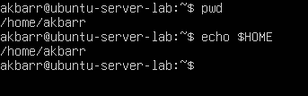
2.Menyimpan hasilnya ke file large-logs.txt  
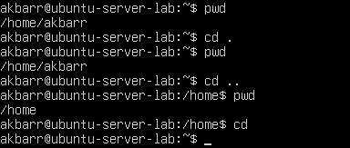  
3.Menampilkan output juga di terminal menggunakan tee  
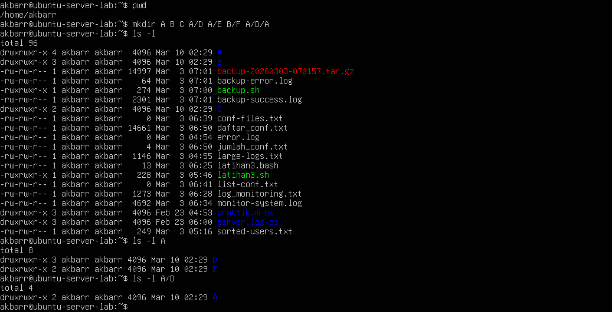
4.Menangani error dengan redirect ke error.logMemahami spesifikasi CPU dan kondisi memori pada server/VM.
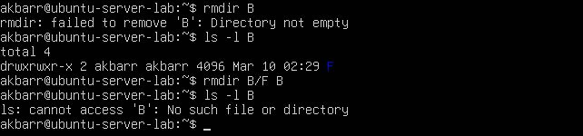

### **Percobaan 2: Manipulasi file**
**Hasil:**  
1.Perintah cp untuk mengkopi file atau seluruh direktori  
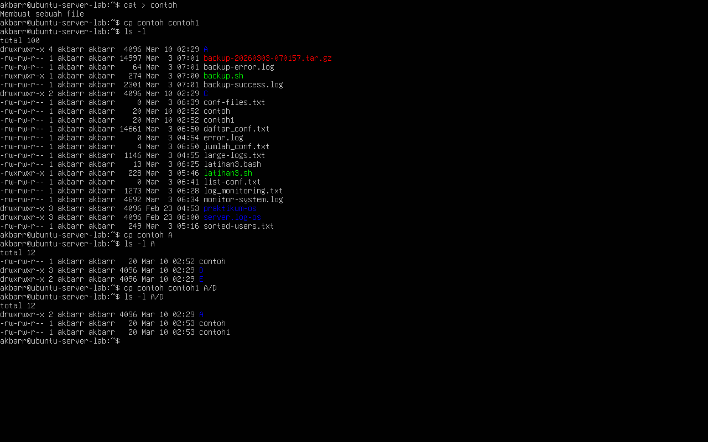
2.Perintah mv untuk memindah file  
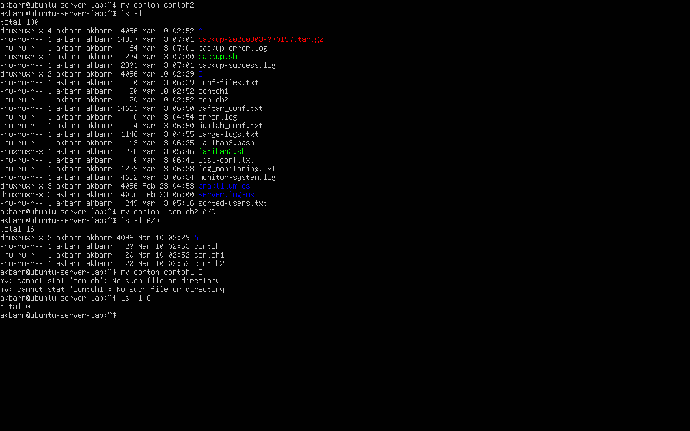  
3.Perintah rm untuk menghapus file  
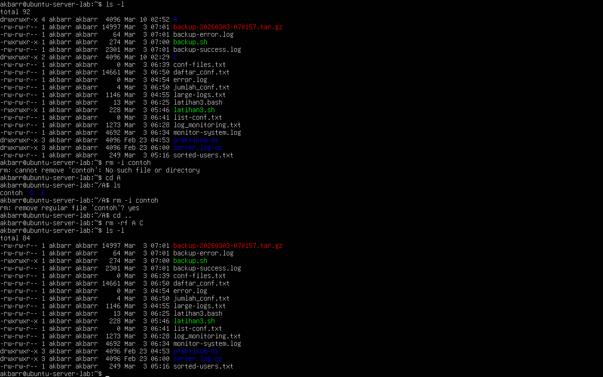

### **Percobaan 3: Symbolic Link**
**Hasil:**  
1.Membuat shortcut (file link)  
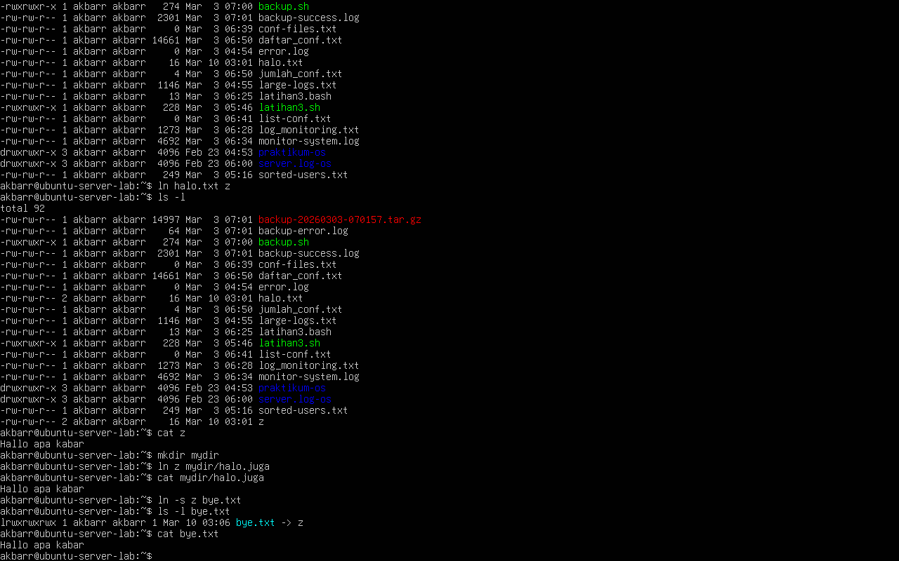

### **Percobaan 4: Melihat Isi File**
**Hasil:**   
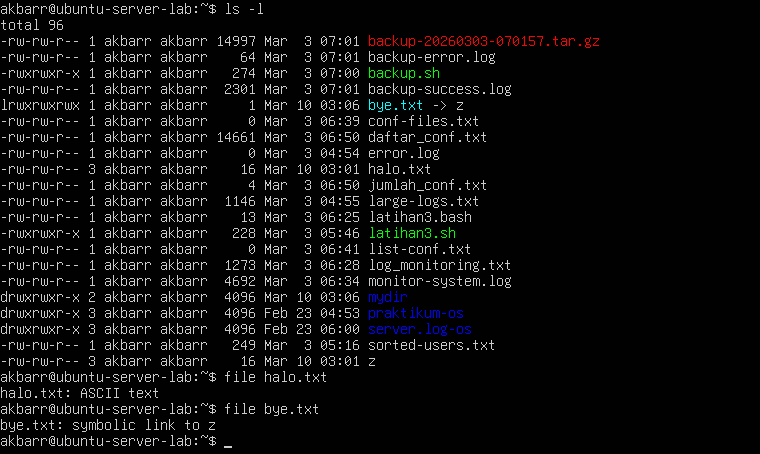

### **Percobaan 5: Mencari file**
**Hasil:**  
1.Perintah find  
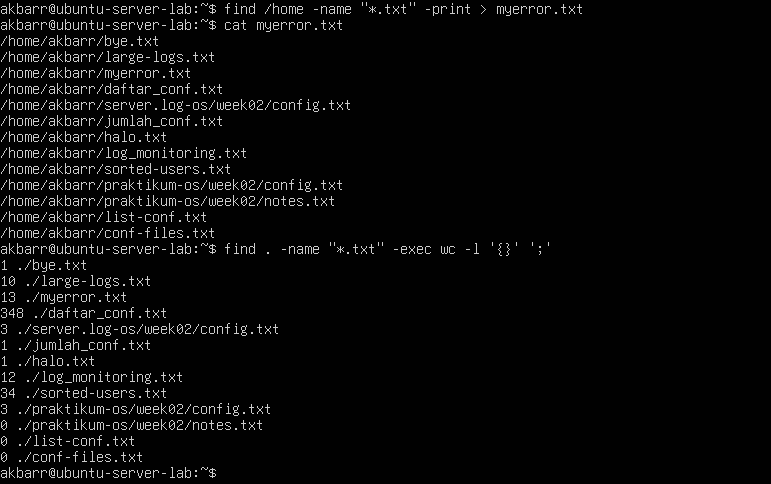  
2.Perintah which  
  
3.Perintah locate  
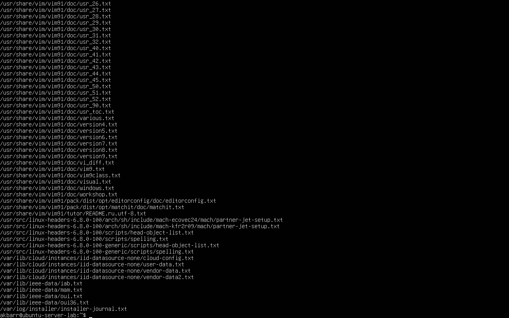

### **Percobaan 6: Mencari text pada file**
**Hasil:**   
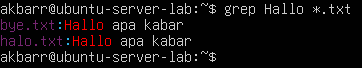

### **Latihan:**
1. **Cobalah urutan perintah berikut :** 
   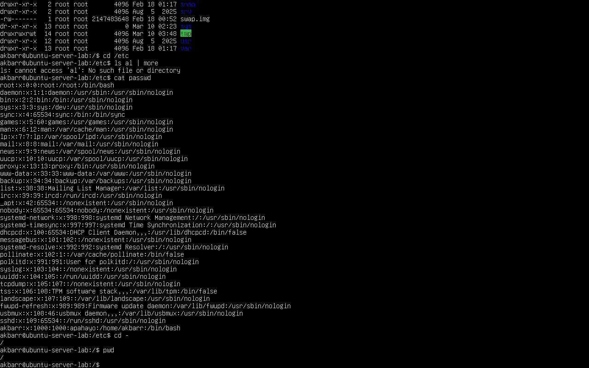

2. **Lanjutkan penelusuran pohon pada sistem file menggunakan cd, ls, pwd dan cat. Telusuri direktory /bin, /usr/bin, /sbin, /tmp dan /boot.** 
   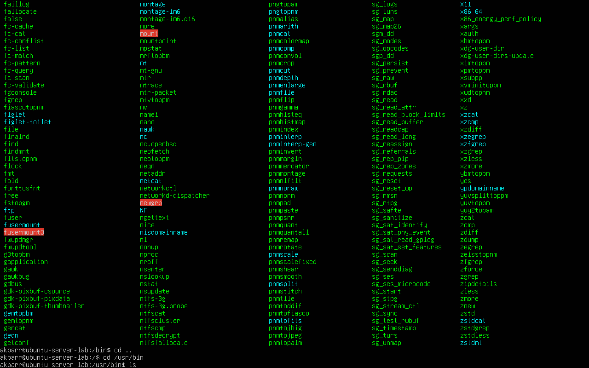

3. **Telusuri direktory /dev. Identifikasi perangkat yang tersedia. Identifikasi tty (termninal) Anda (ketik who am i); siapa pemilih tty Anda (gunakan ls –l).** 
   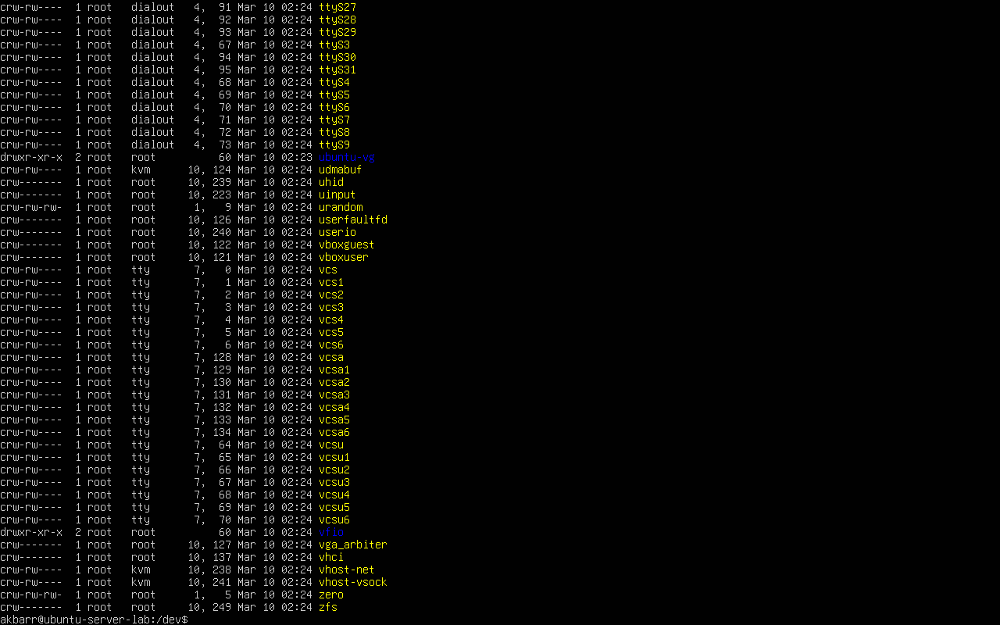

4. **Telusuri derectory /proc.  Tampilkan isi file interrupts, devices,
cpuinfo, meminfo dan uptime menggunakan perintah cat.  Dapatkah Anda
melihat mengapa directory /proc disebut pseudo -filesystem  yang memungkinkan akses ke struktur data kernel ?** 
   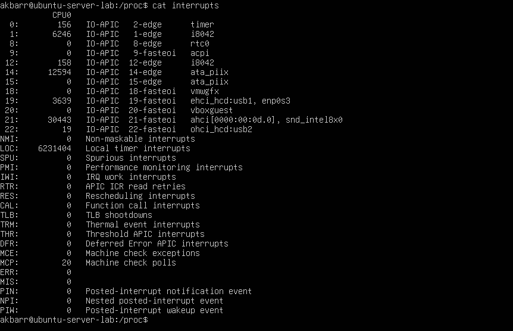

5. **Ubahlah direktory home ke user lain secara langsung menggunakan cd ~username.** 
   

6. **Ubah kembali ke direktory home Anda.** 
   

7. **Buat subdirektory work and play.** 
   

8. *Hapus subdirektory work.** 
   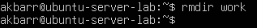

9. **Copy file /etc/passwd ke direktory home Anda.** 
   

10. **Pindahkan ke subdirektory play.** 
   

11. **Ubahlah ke subdirektory play dan buat symbolic link dengan nama terminal yang menunjuk ke perangkat tty.  Apa yang terjadi jika melakukan hard link ke perangkat tty ?** 
   

12. **Buatlah file bernama hello.txt yang berisi kata ”hello word”.  Dapatkah Anda gunakan ”cp” menggunakan ”terminal” sebagai file asal untuk menghasilkan efek yang sama ?** 
   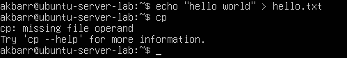

13. **Copy hello.txt ke terminal.  Apa yang terjadi ?** 
   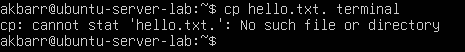

14. **Masih direktory home, copy keseluruhan direktory play ke direktory bernama work menggunakan symbolic link.** 
   

15. **Hapus direktory work dan isinya dengan satu perintah** 
   