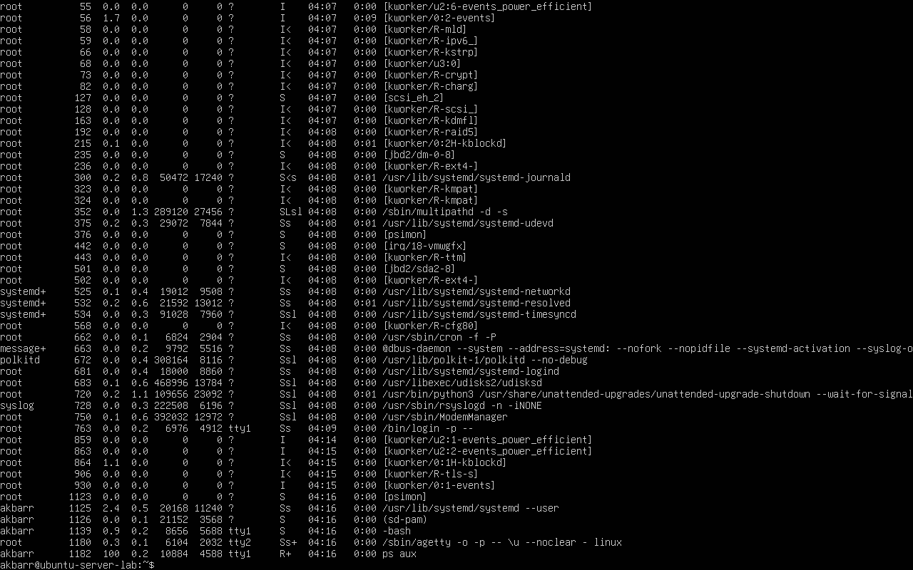
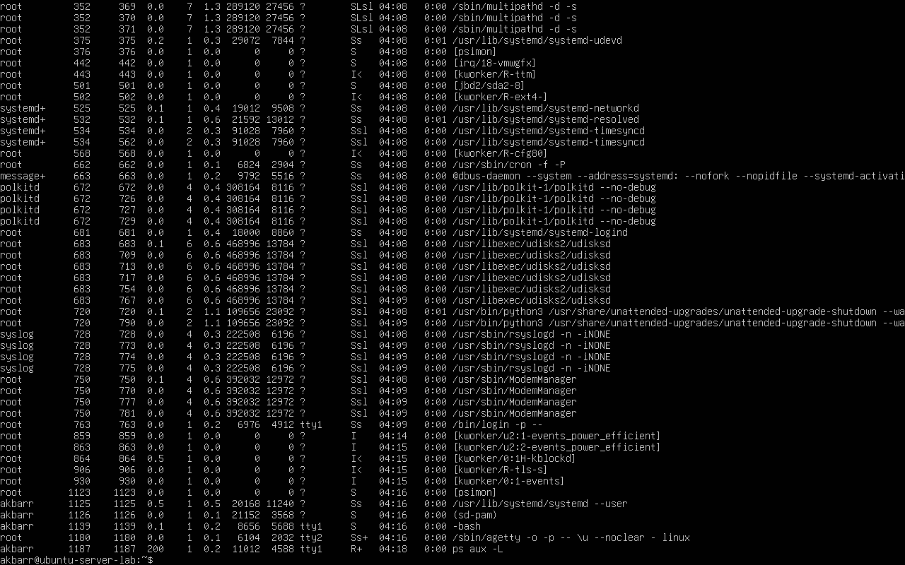
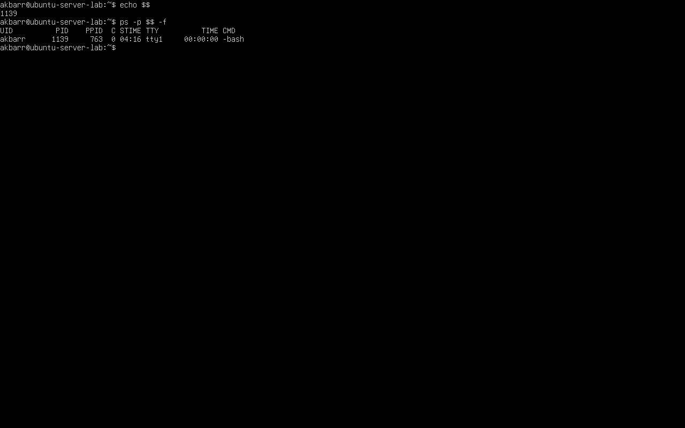
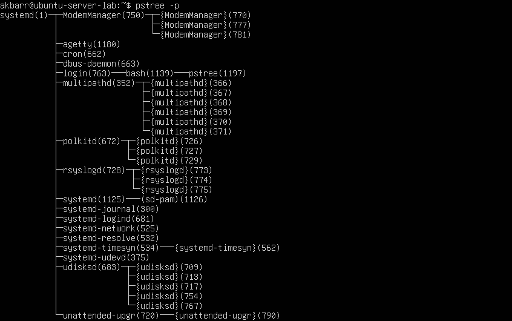
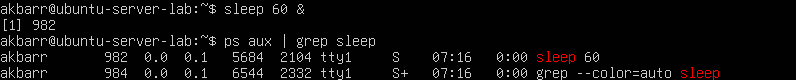
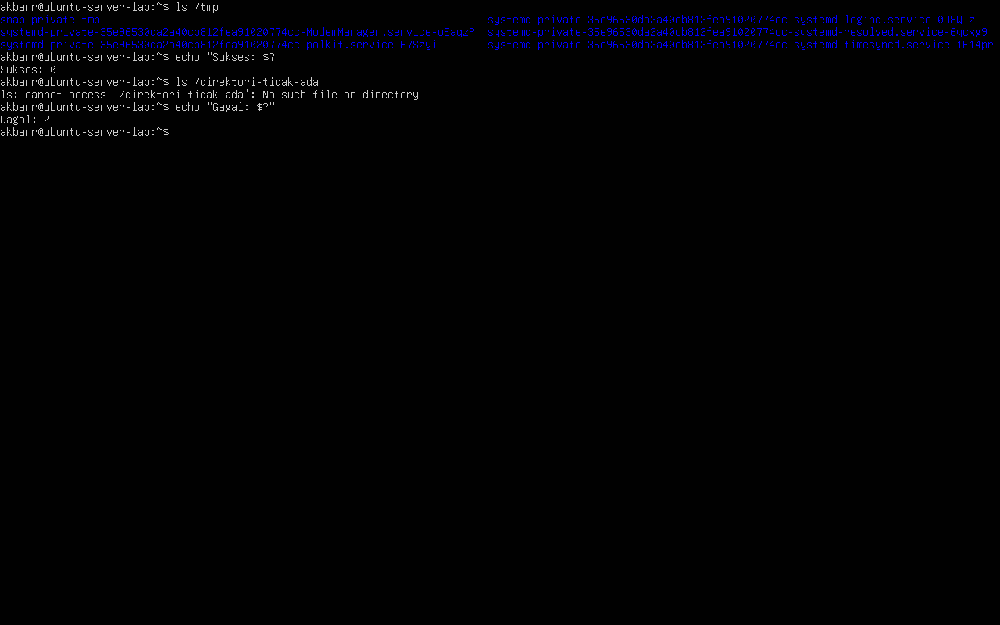
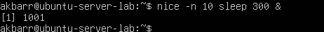
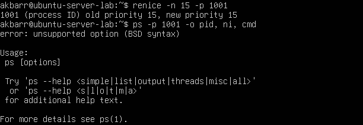
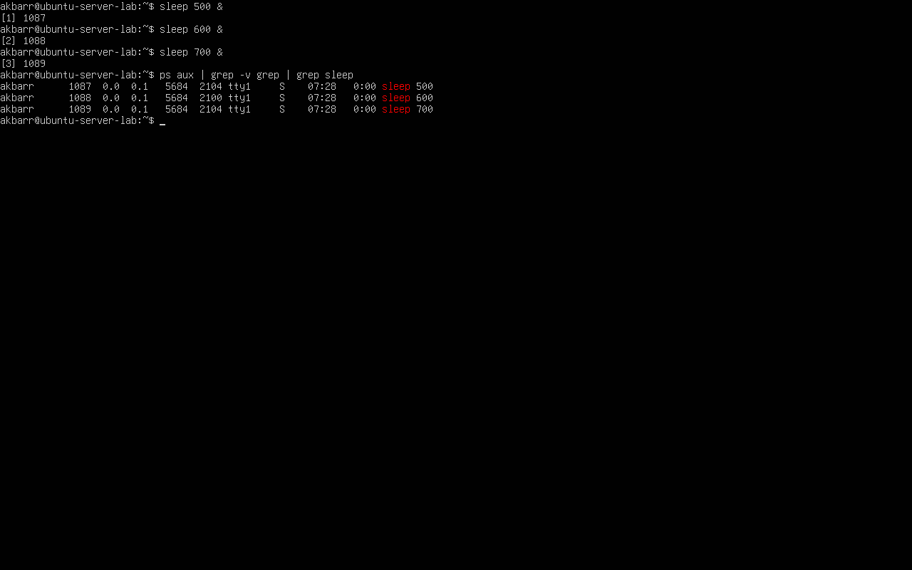

# **Laporan OS Pertemuan 4**

**Nama** : Akbar Bagus Wicaksana  
**NIM** : 254107020067  
**Kelas** : TI-1H  

---

## **Praktikum 6.1: Melihat Proses dan Thread**
**Langkah-langkah:**  
1.Tampilkan semua proses yang berjalan: ps aux  
  
2.Tampilkan proses beserta thread-nya, dapat dilihat pada kolom LWP (LightWeight
Process ID): ps aux -L  
  
3.Lihat PID shell aktif dan detail prosesnya: echo $$, ps -p $$ -f  

4.Lihat hierarki proses secara visual: pstree -p

### **Latihan 6.1**
1.Berapa total proses yang berjalan? Proses apa yang memiliki PID terkecil?

2.Jalankan pstree -p dan temukan proses bash Anda. Proses apa yang menjadi induk (PPID) dari bash tersebut?

3.Bandingkan output ps aux dan ps aux -L. Apa perbedaan yang Anda lihat?

## **Percobaan 6.2: Mengamati Siklus Hidup Proses**
**Langkah-langkah:**  
1.Buat proses di background dan amati kondisinya: sleep 60 &, ps aux | grep sleep  

2.mati perubahan exit code dari perintah yang berhasil dan gagal:  
  

### **Latihan 6.2**
1.Jalankan sleep 120 & dan amati kolom STAT pada ps aux. Kondisi apa yang ditampilkan? Mengapa proses sleep berada di kondisi tersebut?  

2.Jalankan beberapa perintah yang berhasil dan yang gagal, lalu catat exit code masing-masing. Pola apa yang Anda temukan?

## **Praktikum 6.3: Mengatur Prioritas Proses**
**Langkah-langkah:**  
1.Jalankan proses dengan prioritas rendah: nice -n 10 sleep 300 &  

2.Verifikasi nilai nice pada kolom NI: ps aux | grep sleep  

3.Ubah nilai nice proses yang sudah berjalan:  

4.Bersihkan proses percobaan:  

### **Latihan 6.3**
1.Jalankan nice -n 5 sleep 200 & dan verifikasi nilai NI-nya dengan ps.  

2.Ubah nilai nice menjadi 10 menggunakan renice, lalu verifikasi kembali.  

3.Coba ubah nilai nice menjadi -5 tanpa sudo. Apa yang terjadi? Mengapa Linux membatasi hal ini untuk user biasa?

## **Praktikum 6.4: Mengirim Sinyal ke Proses**
**Langkah-langkah:**  
1.Buat proses percobaan:  

2.Hentikan satu proses dengan SIGTERM dan verifikasi:  

3.Jeda dan lanjutkan proses dengan SIGSTOP/SIGCONT:  

4.Hentikan semua proses sleep sekaligus: pkill sleep  

### **Latihan 6.4**
1.Jalankan sleep 400 &, kirim SIGSTOP, dan amati perubahan kolom STAT. Kondisi apa yang muncul?  

2.Kirim SIGCONT dan verifikasi proses kembali berjalan.  

3.Hentikan proses dengan SIGTERM lalu verifikasi sudah tidak ada. Kapan Anda memilih SIGKILL daripada SIGTERM?  

## **Praktikum 6.5: Manajemen Job Foreground dan Background**
**Langkah-langkah:**  
1.Jalankan tiga job di background  

2.Bawa job pertama ke foreground, jeda, lalu kembalikan ke background  

3.Hentikan semua job: kill %1 %2 %3, jobs

### **Latihan 6.5**
1.Jalankan top di foreground. Apa yang terjadi di terminal?  

2.Tekan Ctrl+Z dan cek statusnya dengan jobs. Kondisi apa yang ditampilkan?  

3.Pindahkan ke background dengan bg. Apakah top dapat berjalan dengan baik di background? Mengapa?  

4.Kembalikan ke foreground dengan fg, lalu keluar dengan q .  

## **Praktikum 6.6: Pemantauan Proses**
**Langkah-langkah:**  
1.Temukan proses dengan penggunaan CPU dan memori tertinggi:  

2.Jalankan top dan eksplorasi shortcut-nya:  

3.Instal dan jalankan htop  

### **Latihan 6.6**
1.Gunakan ps aux –sort=%mem untuk menemukan proses yang menggunakan memori paling banyak di VM Anda. Proses apa itu?  

2.Di dalam top, tekan 1 . Apa yang berubah pada tampilan? Mengapa informasi ini berguna?  

3.Di dalam htop, navigasikan ke proses sshd menggunakan tombol panah. Tekan F9 dan amati opsi sinyal yang tersedia.  

## **Latihan 6.A**
**Eksplorasi Proses Sistem**
 1. Jalankan ps aux –forest dan temukan proses dengan PID 1. Apa nama dan fungsi proses tersebut dalam sistem Linux modern?  

 2. Hitung berapa proses yang dimiliki oleh user root dan berapa yang dimiliki oleh user Anda. Mengapa root memiliki lebih banyak proses?  

 3. Temukan semua proses yang berada dalam kondisi S. Mengapa sebagian besar proses di sistem berada dalam kondisi ini?  

## **Latihan 6.B**
**Simulasi Manajemen Job**
 1. Jalankan tiga perintah sleep dengan durasi 100, 200, dan 300 detik di background. Verifikasi ketiganya dengan jobs.  

 2. Bawa job kedua ke foreground, jeda dengan Ctrl+Z , lalu kembalikan ke background dengan bg.  

 3. Hentikan job pertama dengan kill %1. Tampilkan kembali daftar job. Berapa job yang tersisa?  

## **Latihan 6.C**
**Prioritas dan Sinyal**
 1. Jalankan dua proses sleep: satu dengan nice +5 dan satu dengan nice +15. Verifikasi nilai NI keduanya dengan ps.  

 2. Gunakan renice untuk mengubah nice proses pertama menjadi +10. Proses mana yang kini lebih diprioritaskan scheduler?  

 3. Kirim SIGSTOP ke salah satu proses, verifikasi kondisi T-nya, lalu kirim SIGCONT. Akhiri semua proses percobaan dengan pkill sleep.  

