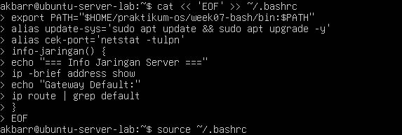
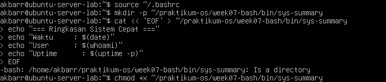
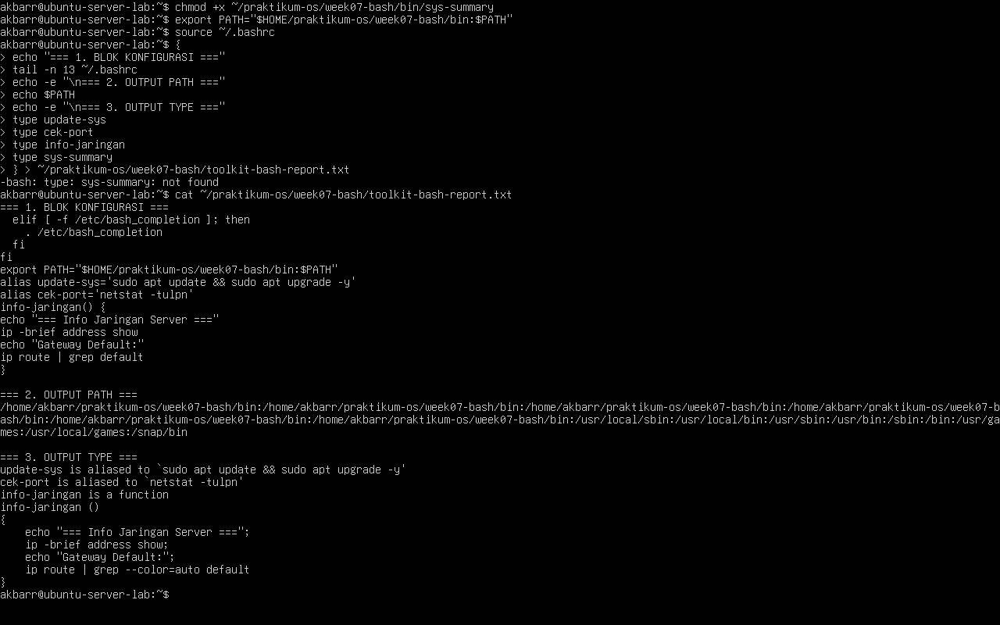
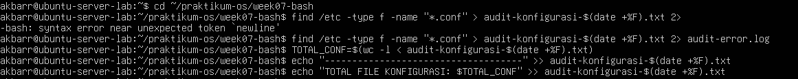
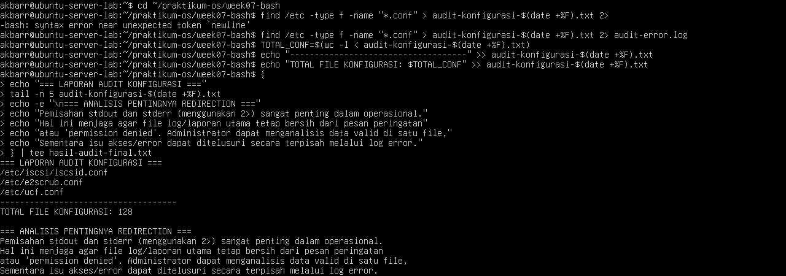
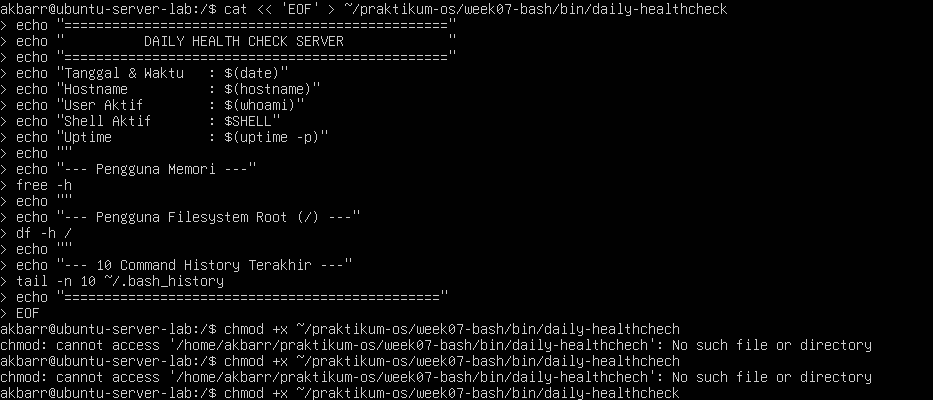
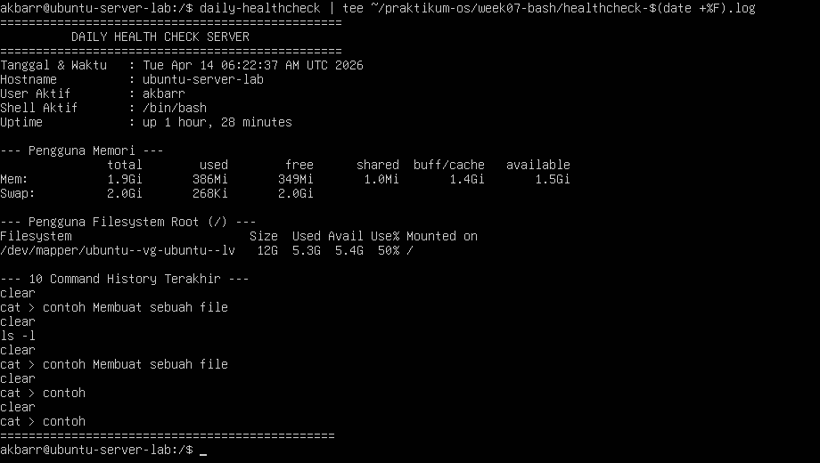
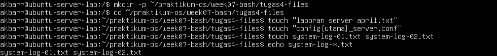
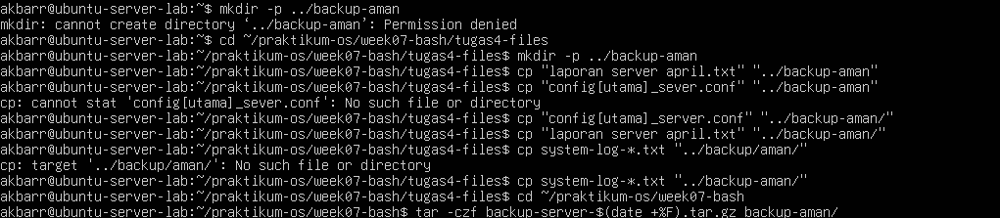
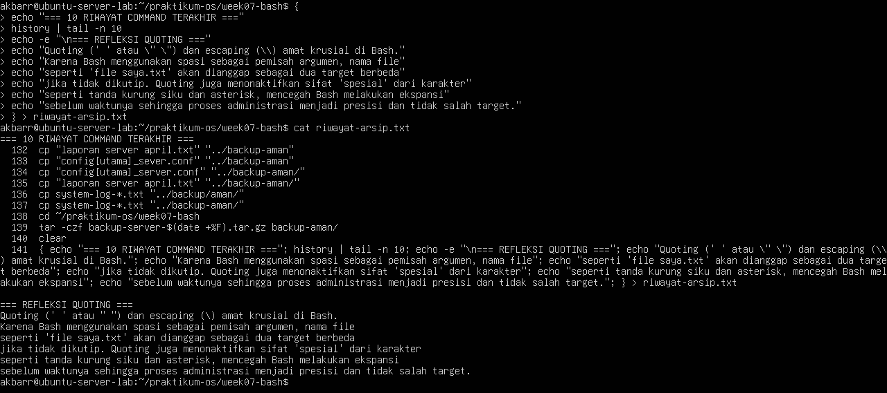

# **Laporan OS Pertemuan 7**

**Nama** : Akbar Bagus Wicaksana  
**NIM** : 254107020067  
**Kelas** : TI-1H  

---

## **Tugas Praktikum 1 — Toolkit Bash Administrator Pribadi**
**Instruksi tugas:**  
1.Menambahkan Konfigurasi ke .bashrc  
  
2.Menerapkan Konfigurasi dan Membuat Script  
  
3.Membuat Laporan Pembuktian  
  

### **Tugas Praktikum 2 — Audit File Konfigurasi dan Logging Aman**  
**Instruksi tugas:**  
1.Menjalankan Pencarian dan Memisahkan Error  
  
2.Membuat Ringkasan dan Menampilkan Laporan (Tee)  
  

## **Tugas Praktikum 3 — Mini Health Check Harian Server**  
**Instuksi tugas:**  
1.Membuat Script Health Check  
  
2.Menjalankan Script dan Menyimpan Log  
  

### **Tugas Praktikum 4 — Penanganan File dengan Nama Kompleks dan Arsip Aman**  
**Instruksi tugas:**  
1.Menyiapkan File dan Menguji Akses (Quoting)  
  
2.Menyalin File Secara Aman dan Membuat Arsip Tar  
  
3.Membuat Refleksi Quoting dan Riwayat  
  