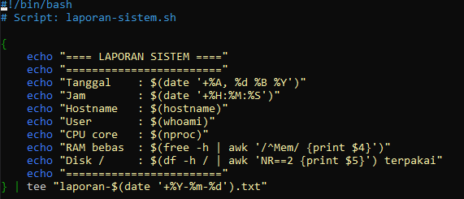
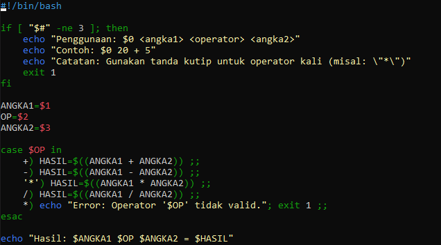
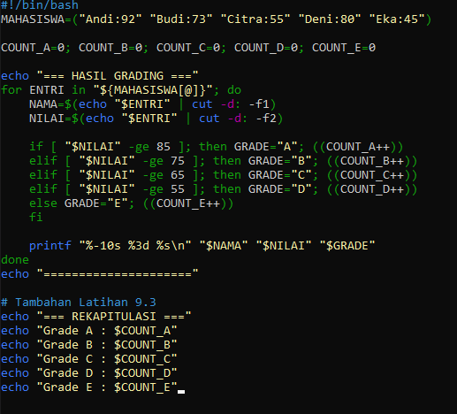
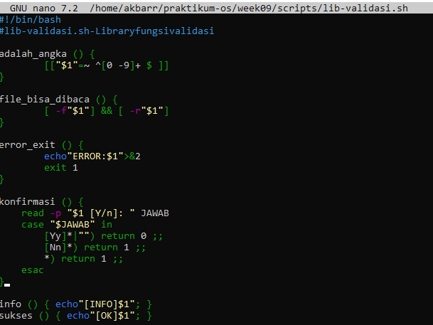
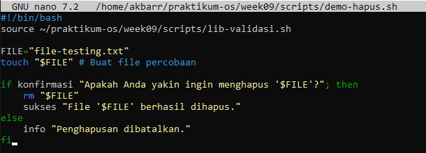
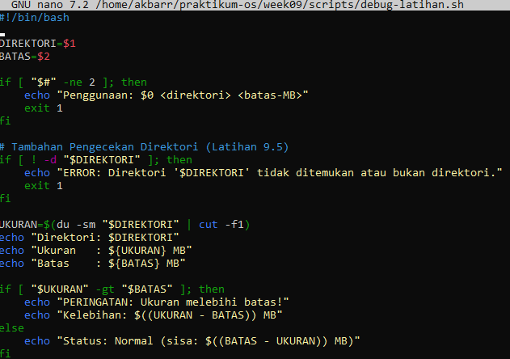
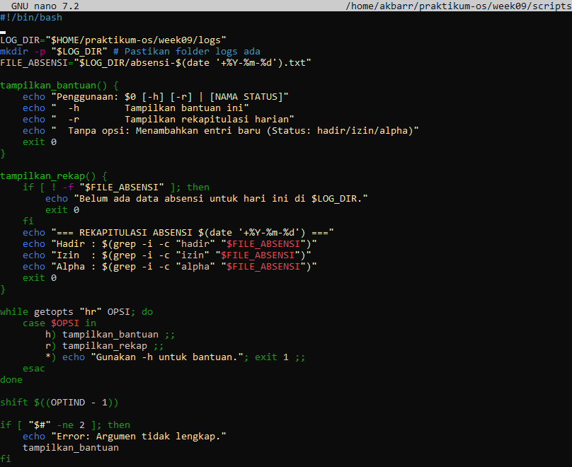
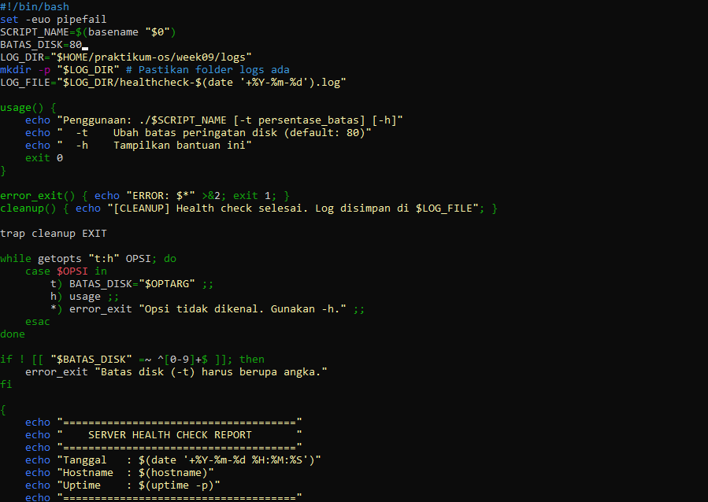
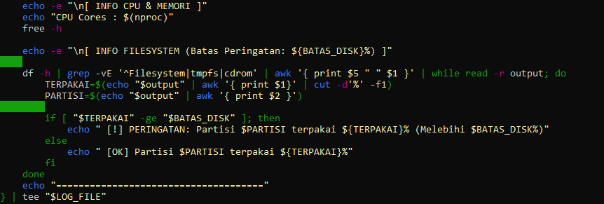

# **Laporan OS Pertemuan 9**

**Nama** : Akbar Bagus Wicaksana  
**NIM** : 254107020067  
**Kelas** : TI-1H  

---

## **Latihan 9.1**  
Modifikasi laporan-sistem.sh agar menyimpan output ke file
laporan-YYYY-MM-DD.txt sekaligus menampilkannya di terminal. Petunjuk:
gunakan tee yang sudah dipelajari di bab sebelumnya.  
  

## **Latihan 9.2**  
Buat script kalkulator.sh yang menerima tiga argumen: angka1
operator angka2 dengan operator +, -, *, atau /. Contoh:
./kalkulator.sh 20 + 5 menghasilkan 25. Gunakan case untuk memilih
operasi, dan validasi jika argumen tidak lengkap.  
  

## **Latihan 9.3**  
Tambahkan ke script grading-batch.sh sebuah ringkasan di bagian bawah
yang menampilkan: jumlah mahasiswa per grade (A, B, C, D, E) menggunakan perulangan for kedua yang mengiterasi array MAHASISWA.  
  

## **Latihan 9.4**
Tambahkan fungsi konfirmasi() ke lib-validasi.sh. Fungsi ini menampilkan pertanyaan, membaca input Y/N dari user, mengembalikan 0 jika Y dan 1 jika N. Buat script demo yang memanggil fungsi ini sebelum menghapus sebuah file.
**lib-validasi.sh**  
  
**demo-hapus.sh**  
  

## **Latihan 9.5**  
Script debug-latihan.sh tidak menangani direktori yang tidak ada. Perbaiki dengan menambahkan:
• set -e di baris kedua
• Pengecekan -d "$DIREKTORI" sebelum memanggil du
• Pesan error yang informatif jika direktori tidak ditemukan
Uji dengan direktori yang tidak ada.  
  

## **Tugas 1 Script Absensi Kelas**
**Konteks:** instruktur mencatat kehadiran mahasiswa dari command line.  
  

## **Tugas 2 Script Health Check Sistem**
**Konteks:** administrator membuat pemeriksaan kondisi server sebelum maintenance.  

